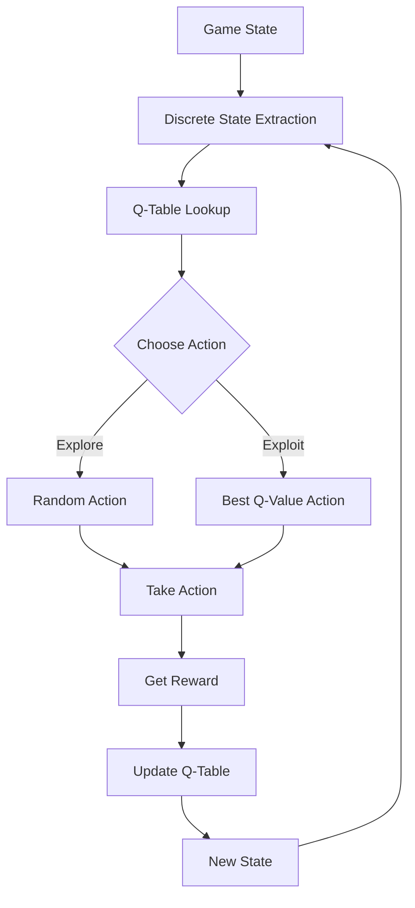
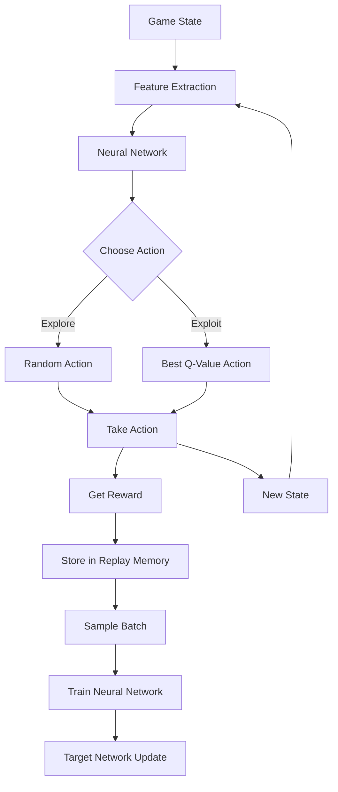

# Visual Comparison: Q-Learning vs DQN in Bunner Game

## Q-Learning Visual Representation



### Q-Table Structure

```
State                      | UP    | RIGHT | DOWN  | LEFT  | WAIT
---------------------------|-------|-------|-------|-------|-------
(x_bin, row_type, etc...) | 0.5   | 7.2   | -1.0  | 2.1   | 0.0
```

### Q-Learning Formula

```
Q(s,a) = Q(s,a) + α[r + γ max(Q(s',a')) - Q(s,a)]
```

Where:

- Q(s,a): Current Q-value for state s and action a
- α: Learning rate (ALPHA = 0.1)
- r: Reward received
- γ: Discount factor (GAMMA = 0.99)
- max(Q(s',a')): Best Q-value for next state
- s': Next state
- a': Action in next state

## DQN Visual Representation



### Neural Network Architecture

```
Input Layer (state) → Hidden Layer (128 neurons) → Hidden Layer (128 neurons) → Output Layer (actions)
```

### Experience Replay Buffer

```
[
  (state₁, action₁, reward₁, next_state₁, done₁),
  (state₂, action₂, reward₂, next_state₂, done₂),
  ...
  (stateₙ, actionₙ, rewardₙ, next_stateₙ, doneₙ)
]
```

## Key Components Comparison

### Q-Learning Implementation

- **State Representation**: `(player_x_bin, current_row_type, next_row_type, on_cooldown, dist_left_bin, dist_right_bin, dist_ahead_bin, dist_behind_bin)`
- **Storage**: Python dictionary (self.q_table)

```python
self.q_table = defaultdict(lambda: {action: 0.0 for action in self.actions})
```

- **Action Selection**: Epsilon-greedy policy

```python
if random.uniform(0, 1) < self.epsilon:
    action = random.choice(self.actions)  # Explore
else:
    action = max(self.q_table[state], key=self.q_table[state].get)  # Exploit
```

- **Learning**: Single update per step
- **Memory Efficiency**: Smaller for simple games, larger for complex games

### DQN Implementation

- **State Representation**: Same information as Q-learning but processed as a feature vector for neural network input
- **Storage**: Neural network weights (PyTorch model)

```python
self.policy_net = DQN(state_size, self.n_actions).to(device)
self.target_net = DQN(state_size, self.n_actions).to(device)
```

- **Action Selection**: Epsilon-greedy with neural network predictions

```python
if sample > eps_threshold:
    q_values = self.policy_net(state_tensor)
    action_index = q_values.max(1)[1].view(1, 1)
    return self.actions[action_index.item()]
else:
    return random.choice(self.actions)
```

- **Learning**: Batch updates from replay memory
- **Experience Replay**: Store experience tuples and randomly sample batches

```python
class ReplayMemory:
    def __init__(self, capacity):
        self.memory = deque([], maxlen=capacity)
```

- **Target Network**: Stabilizes learning by providing consistent Q-value targets

```python
# Update target network periodically
if self.steps_done % self.target_update == 0:
    self.target_net.load_state_dict(self.policy_net.state_dict())
```

## DQN Loss Function

```
Loss = SmoothL1Loss(Q(s,a), r + γ * max(Q(s',a')) * (1 - done))
```

Where:

- Q(s,a): Predicted Q-value from policy network
- r: Reward
- γ: Discount factor (GAMMA = 0.99)
- max(Q(s',a')): Max Q-value for next state from target network
- done: 1 if terminal state, 0 otherwise
